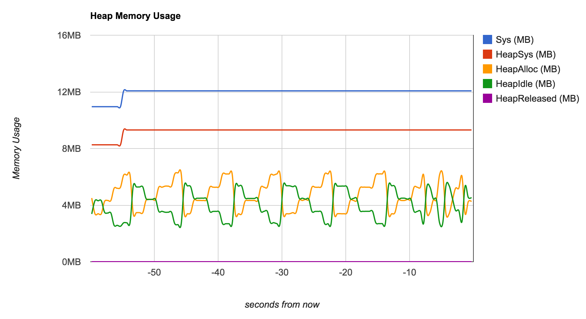

# Uptime: Building Resilient Services with Go

Here, you'll find the slides, resoures, and example code for my [2015 GopherCon](http://www.gophercon.com/) talk, ["Uptime: Building Resilient Services with Go"](http://www.gophercon.com/talks/uptime/).

Slides
------

[2015-GopherCon-Talk-Uptime.pdf](2015-GopherCon-Talk-Uptime.pdf)

Notes
-----

[Creating Great Version Strings](Versioning-HOWTO.md)

Go Memory Profiler
-----------------

Source code: [here](https://github.com/FogCreek/profiler)

Running Example: [here](http://sump.blakecaldwell.net/profiler/info.html)

Example Code
------------

	// TODO!

